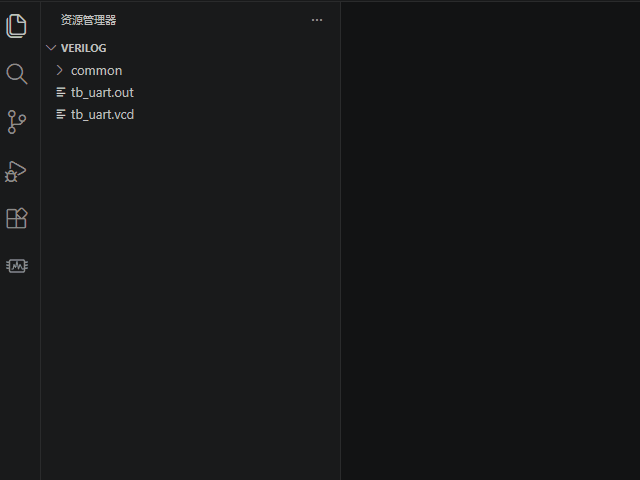

# VeriFlow — VS Code Extension

<div align="center">

**在编辑器中一键完成 Verilog 仿真全流程：分析 → 编译 → 仿真 → 查看波形**

[](https://code.visualstudio.com/)
[](LICENSE)
[](https://www.typescriptlang.org/)

</div>

---

## 简介

VeriFlow 是一个为 Verilog/SystemVerilog 开发者打造的 VS Code 扩展。它将**模块扫描、依赖分析、编译仿真、波形查看**集成在编辑器侧边栏中，无需离开 VS Code 即可完成整个仿真流程。

**完全零依赖** — 核心引擎全部用 TypeScript 原生实现，不需要安装任何外部依赖。

## 功能演示



## 快速开始

### 前提条件

- **VS Code 1.80+**
- **一款 Verilog 仿真器**（至少安装一款）：
  - [Icarus Verilog](http://iverilog.icarus.com/) — 开源，推荐
  - [Synopsys VCS](https://www.synopsys.com/verification/simulation/vcs.html) — 商业
  - [Xilinx XSim](https://www.xilinx.com/products/design-tools/vivado.html) — 商业
  - 或自行配置自定义仿真器
- **波形查看器**（可选）：
  - [Surfer](https://surfer-project.org/) — 开源，推荐
  - [GTKWave](https://gtkwave.sourceforge.net/) — 开源
  - 或自行配置自定义波形查看器

### 安装

扩展商店搜索 `VeriFlow` 安装，或手动安装 `.vsix` 文件。

### 使用流程

1. 在 VS Code 中打开包含 `.v` / `.sv` 文件的文件夹
2. 点击活动栏的 **VeriFlow 图标**（芯片形状），打开侧边栏
3. 扩展自动扫描所有模块，按目录分组展示
4. 点击 **Select Top Module** 在列表中选择顶层模块
5. 点击 **Analyze Dependencies** 解析依赖关系
6. 点击 **Compile & Simulate** 运行仿真
7. 点击 **Open Waveform** 查看波形

---

## 扩展设置

| 配置项 | 类型 | 默认值 | 说明 |
|--------|------|--------|------|
| `veriflow.libDirs` | `string[]` | `[]` | 库目录路径列表 |
| `veriflow.simulator` | `enum` | `iverilog` | 仿真器：`iverilog` / `vcs` / `xsim` / `custom` |
| `veriflow.waveViewer` | `enum` | `surfer` | 波形查看器：`surfer` / `gtkwave` / `custom` |
| `veriflow.simulatorCompileCmd` | `string` | `""` | 自定义编译命令模板。支持 `{files}` `{output}` `{top_module}` 占位符 |
| `veriflow.simulatorRunCmd` | `string` | `""` | 自定义运行命令模板。支持 `{output}` 占位符 |
| `veriflow.waveViewerCmd` | `string` | `""` | 自定义波形查看器命令。支持 `{wave_file}` 占位符 |
| `veriflow.waveFileTemplate` | `string` | `{top_module}.vcd` | 波形文件路径模板。支持 `{top_module}` 占位符 |

---

## 侧边栏说明

侧边栏分为三个区域：

### 1. 操作按钮（标题栏）

从左到右依次为：
- **Select Top Module** — 从已扫描模块中选择顶层
- **Analyze Dependencies** — BFS 依赖解析，生成编译顺序
- **Compile & Simulate** — 编译并执行仿真
- **Open Waveform** — 启动波形查看器
- **Scan Modules** — 重新扫描工作区

### 2. Top Module

显示当前选中的顶层模块名称，点击可重新选择。

### 3. Dependency Tree

依赖分析后展示模块层级关系，缩进表示依赖深度。点击模块名可在编辑器中打开对应文件。

### 4. All Modules

按目录分组的全部模块清单。标记 `[dep]` 的模块是依赖树中的一部分。

---

## 输出面板

仿真过程中的所有输出实时显示在 **Output** 面板中（选择 `VeriFlow` 通道），按日志级别区分：

- `[INFO]` — 普通信息
- `[OK]` — 成功信息
- `[WARN]` — 警告
- `[ERROR]` — 错误信息（含文件引用和行号）

---

## 支持的仿真器预置命令

| 仿真器 | 编译命令模板 | 运行命令模板 |
|--------|-------------|-------------|
| iverilog | `iverilog -o "{output}" {files}` | `vvp "{output}"` |
| vcs | `vcs -full64 -o "{output}" {files}` | `./"{output}"` |
| xsim | `xvlog {files} && xelab {top_module} -snapshot "{output}"` | `xsim "{output}" --runall` |
| custom | （自行定义） | （自行定义） |

## 自定义仿真器配置示例

```json
{
  "veriflow.simulator": "custom",
  "veriflow.simulatorCompileCmd": "verilator --cc --exe --build -j -o {output} {files}",
  "veriflow.simulatorRunCmd": "{output}",
  "veriflow.waveViewer": "custom",
  "veriflow.waveViewerCmd": "gtkwave {wave_file} &",
  "veriflow.libDirs": [
    "/path/to/shared/libs",
    "/path/to/vip"
  ]
}
```

---

## 架构

```
vscode-extension/src/
├── core/                       # 核心引擎（TypeScript 原生）
│   ├── types.ts                # 类型定义
│   ├── verilogUtils.ts         # Verilog 语法工具
│   ├── fileService.ts          # 文件系统服务
│   ├── dependencyAnalyzer.ts   # BFS 依赖分析器
│   ├── templateEngine.ts       # 命令模板引擎
│   ├── processManager.ts       # 进程管理
│   ├── logParser.ts            # 仿真日志解析
│   ├── simulationRunner.ts     # 仿真执行器
│   └── portParser.ts           # 端口解析器
├── config.ts                   # 扩展设置管理
├── output.ts                   # 输出面板封装
├── moduleTreeProvider.ts       # 侧边栏树视图
└── extension.ts                # 扩展主入口
```

---

## 常见问题

### Q: 为什么看不到 VeriFlow 图标？

确保当前打开的工作区包含 `.v` 或 `.sv` 文件，扩展会在检测到这类文件时自动激活。

### Q: 编译报错 "command not found"？

请确保仿真器已安装并在系统 PATH 中。可以在终端中手动运行 `iverilog`、`vcs` 等命令验证。

### Q: 波形文件找不到？

先运行仿真生成波形文件。波形文件路径由 `veriflow.waveFileTemplate` 决定，默认在工作区根目录生成 `{top_module}.vcd`。

---

## 许可证

MIT

---

## 反馈与贡献

有问题或建议？欢迎 [提交 Issue](https://github.com/AlexMercer12138/VeriFlow/issues)。
